#  🔶 Modelagem do B.D da Diiner's Burgers❗ 🔶

## 1- Cenário Detalhado
A Diiner's Burgers, empresa fictícia criada para realização do P.I da FATEC-Franca, deseja desenvolver um sistema de banco de dados para gerenciar suas operações de vendas realizadas pelo Web Site, incluindo o cadastro de clientes, produtos (hambúrgueres , acompanhamentos, bebidas e sobremesas), pedidos, entregas e pagamentos. Para isso, foi elaborado este banco de dados para atender a demanda e as necessidades do cliente.

## 2- Modelagem Conceitual ✏️
> [!NOTE]
> A modelagem conceitual foi realizada no brModelo e atendeu os conceitos do MER e DER

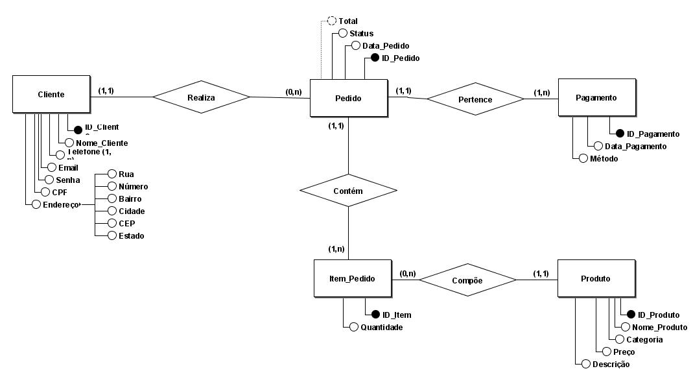

## 3- Modelagem Lógica 🧠
> [!NOTE]
> A modelagem conceitual foi realizada no brModelo
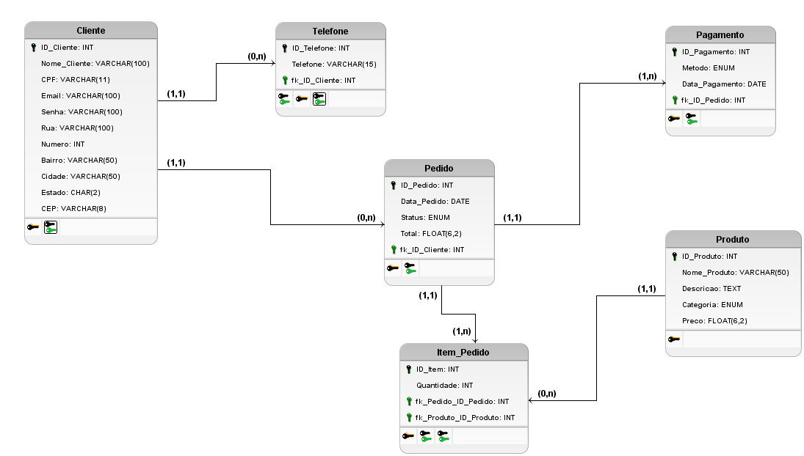

## 4- Modelagem Física 📃💻
> [!IMPORTANT]
> O SGBD escolhido foi o MySQL

A modelagem física foi dividida em duas etapas:

- Criando e selecionando o banco de dados
```sql
CREATE DATABASE DB_BURGER;
USE DB_BURGER;
```

- Criando as tabelas
```sql
CREATE TABLE Cliente (
    ID_Cliente INT PRIMARY KEY AUTO_INCREMENT,
    Nome_Cliente VARCHAR(100) NOT NULL,
    CPF VARCHAR(11) NOT NULL UNIQUE,
    Email VARCHAR(100) NOT NULL UNIQUE,
    Senha VARCHAR(100) NOT NULL,
    Rua VARCHAR(100),
    Numero INT,
    Bairro VARCHAR(50),
    Cidade VARCHAR(50),
    Estado CHAR(2),
    CEP VARCHAR(8)
);
CREATE TABLE Telefone_Cliente (
    ID_Telefone INT PRIMARY KEY AUTO_INCREMENT,
    Telefone VARCHAR(15),
    fk_ID_Cliente INT,
    FOREIGN KEY (fk_ID_Cliente) REFERENCES Cliente(ID_Cliente)
);

CREATE TABLE Produto (
    ID_Produto INT PRIMARY KEY AUTO_INCREMENT,
    Nome VARCHAR(100) NOT NULL,
    Descricao TEXT,
    Preco DECIMAL(6, 2) NOT NULL,
    Tipo ENUM('Hamburguer', 'Acompanhamento', 'Bebida', 'Sobremesa') NOT NULL,
    CHECK (Preco > 0)
);
 
CREATE TABLE Pedido (
    ID_Pedido INT PRIMARY KEY AUTO_INCREMENT,
    Data_Pedido DATETIME NOT NULL,
    Status ENUM('Pendente', 'Preparando', 'Enviado', 'Entregue', 'Cancelado') NOT NULL,
    fk_ID_Cliente INT,
    FOREIGN KEY (fk_ID_Cliente) REFERENCES Cliente(ID_Cliente) ON DELETE CASCADE
);

ALTER TABLE Pedido
ADD COLUMN Total DECIMAL(10, 2);

CREATE TABLE Item_Pedido (
    ID_Item INT PRIMARY KEY AUTO_INCREMENT,
    Quantidade INT NOT NULL,
    fk_ID_Pedido INT,
    fk_ID_Produto INT,
    FOREIGN KEY (fk_ID_Pedido) REFERENCES Pedido(ID_Pedido) ON DELETE CASCADE,
    FOREIGN KEY (fk_ID_Produto) REFERENCES Produto(ID_Produto) ON DELETE CASCADE
);

CREATE TABLE Pagamento (
    ID_Pagamento INT PRIMARY KEY AUTO_INCREMENT,
    Data_Pagamento DATETIME NOT NULL,
    Metodo ENUM('Cartao', 'Dinheiro', 'Pix') NOT NULL,
    fk_ID_Pedido INT,
    FOREIGN KEY (fk_ID_Pedido) REFERENCES Pedido(ID_Pedido) ON DELETE CASCADE
);

/* 
CALCULANDO O VALOR TOTAL DA TABELA PEDIDO - TIVE QUE PESQUISAR NA INTERNET
Dica:
O ip é um alias (apelido) escolhido para a tabela Item_Pedido, usado para simplificar as referências à tabela no restante da consulta.
O p é um alias escolhido para a tabela Produto.
é possível fazer sem o alias, porém o código fica mais poluído. Ficaria assim:
	FROM Item_Pedido
	JOIN Produto ON Item_Pedido.ID_Produto = Produto.ID_Produto
	WHERE Item_Pedido.ID_Pedido = Pedido.ID_Pedido
*/

DELIMITER //
CREATE TRIGGER calcular_total_pedido
AFTER INSERT ON Item_Pedido
FOR EACH ROW
BEGIN
    UPDATE Pedido
    SET Total = (SELECT SUM(ip.Quantidade * p.Preco)
                 FROM Item_Pedido ip
                 JOIN Produto p ON ip.fk_ID_Produto = p.ID_Produto
                 WHERE ip.fk_ID_Pedido = NEW.fk_ID_Pedido)
    WHERE ID_Pedido = NEW.fk_ID_Pedido;
END;
//
DELIMITER ;
```
### Resultado das tabelas antes da inserção das tuplas
<div style="display: flex; flex-direction: column; justify-content:center;">
	<p>Tabela Cliente</p>
	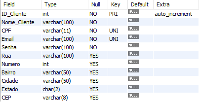
	<p>Tabela Telefone (criada por conta de ser multivalorada)</p>
	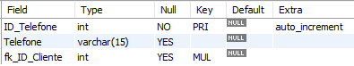
	<p>Tabela Produto</p>
	
	<p>Tabela Pedido</p>
	
	<p>Tabela Item-Pedido</p>
	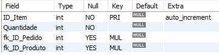
	<p>Tabela Pagamentos</p>
	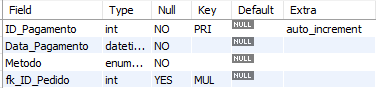
</div>
<hr>

## 5- Inserção de Dados
Na inserção de dados foram obedecidos os requisitos propostos pela atividade. São eles:
- Inserir dados em todas as tabelas
- Utilizar a linguagem SQL com o SGB de preferência que, nesse caso, foi o MySQL
- Inserir ao menos 20 dados em cada tabela
  
```sql
/* Inserindo dados nas tabelas */

INSERT INTO Cliente (Nome_Cliente, CPF, Email, Senha, Rua, Numero, Bairro, Cidade, Estado, CEP)
VALUES
('João Silva', '12345678901', 'joao@example.com', 'senha123', 'Rua A', 123, 'Centro', 'São Paulo', 'SP', '12345678'),
('Maria Oliveira', '98765432100', 'maria@example.com', 'senha456', 'Rua B', 456, 'Centro', 'Rio de Janeiro', 'RJ', '87654321'),
('Carlos Mendes', '12345678902', 'carlos@example.com', 'senha789', 'Rua C', 789, 'Centro', 'Curitiba', 'PR', '34567890'),
('Ana Sousa', '98765432101', 'ana@example.com', 'senha1011', 'Rua D', 1011, 'Centro', 'Belo Horizonte', 'MG', '56789012'),
('Pedro Lima', '12345678903', 'pedro@example.com', 'senha1314', 'Rua E', 1314, 'Centro', 'Brasília', 'DF', '23456789'),
('Fernanda Santos', '98765432102', 'fernanda@example.com', 'senha1516', 'Rua F', 1516, 'Centro', 'Salvador', 'BA', '67890123'),
('Lucas Oliveira', '12345678904', 'lucas@example.com', 'senha1718', 'Rua G', 1718, 'Centro', 'Fortaleza', 'CE', '78901234'),
('Mariana Silva', '98765432103', 'mariana@example.com', 'senha1920', 'Rua H', 1920, 'Centro', 'Recife', 'PE', '89012345'),
('Gabriel Santos', '12345678905', 'gabriel@example.com', 'senha2122', 'Rua I', 2122, 'Centro', 'Manaus', 'AM', '90123456'),
('Juliana Lima', '98765432104', 'juliana@example.com', 'senha2324', 'Rua J', 2324, 'Centro', 'Porto Alegre', 'RS', '01234567'),
('Rafael Sousa', '12345678906', 'rafael@example.com', 'senha2526', 'Rua K', 2526, 'Centro', 'Goiânia', 'GO', '12345678'),
('Amanda Costa', '98765432105', 'amanda@example.com', 'senha2728', 'Rua L', 2728, 'Centro', 'Florianópolis', 'SC', '34567890'),
('Thiago Oliveira', '12345678907', 'thiago@example.com', 'senha2930', 'Rua M', 2930, 'Centro', 'Vitória', 'ES', '56789012'),
('Carolina Santos', '98765432106', 'carolina@example.com', 'senha3132', 'Rua N', 3132, 'Centro', 'Natal', 'RN', '78901234'),
('Bruno Lima', '12345678908', 'bruno@example.com', 'senha3334', 'Rua O', 3334, 'Centro', 'João Pessoa', 'PB', '89012345'),
('Larissa Silva', '98765432107', 'larissa@example.com', 'senha3536', 'Rua P', 3536, 'Centro', 'Cuiabá', 'MT', '90123456'),
('Gustavo Oliveira', '12345678909', 'gustavo@example.com', 'senha3738', 'Rua Q', 3738, 'Centro', 'Campo Grande', 'MS', '01234567'),
('Tatiane Santos', '98765432108', 'tatiane@example.com', 'senha3940', 'Rua R', 3940, 'Centro', 'Teresina', 'PI', '23456789'),
('Rodrigo Lima', '12345678910', 'rodrigo@example.com', 'senha4142', 'Rua S', 4142, 'Centro', 'Aracaju', 'SE', '45678901'),
('Luana Silva', '98765432109', 'luana@example.com', 'senha4344', 'Rua T', 4344, 'Centro', 'Belém', 'PA', '67890123'),
('Eduardo Oliveira', '12345678911', 'eduardo@example.com', 'senha4546', 'Rua U', 4546, 'Centro', 'Maceió', 'AL', '89012345'),
('Patrícia Santos', '98765432110', 'patricia@example.com', 'senha4748', 'Rua V', 4748, 'Centro', 'São Luís', 'MA', '01234567');

INSERT INTO Telefone_Cliente (Telefone, fk_ID_Cliente)
VALUES
('(11) 91234-5678', 1),
('(21) 92345-6789', 2),
('(41) 93456-7890', 3),
('(31) 94567-8901', 4),
('(61) 95678-9012', 5),
('(71) 96789-0123', 6),
('(85) 97890-1234', 7),
('(81) 98901-2345', 8),
('(92) 99012-3456', 9),
('(51) 90123-4567', 10),
('(62) 91234-5678', 11),
('(48) 92345-6789', 12),
('(27) 93456-7890', 13),
('(84) 94567-8901', 14),
('(83) 95678-9012', 15),
('(65) 96789-0123', 16),
('(67) 97890-1234', 17),
('(86) 98901-2345', 18),
('(79) 99012-3456', 19),
('(91) 90123-4567', 20),
('(82) 91234-5678', 21),
('(98) 92345-6789', 22);

INSERT INTO Produto (Nome, Descricao, Preco, Tipo)
VALUES
('Hamburguer Clássico', 'Pão, carne bovina, queijo, alface, tomate e molho especial', 22.90, 'Hamburguer'),
('Batata Frita', 'Porção de batatas fritas crocantes com sal', 10.50, 'Acompanhamento'),
('Refrigerante Lata', 'Lata de refrigerante de 350ml', 4.99, 'Bebida'),
('Sundae', 'Sorvete de baunilha com calda de chocolate e castanhas', 7.90, 'Sobremesa'),
('Hamburguer Vegano', 'Pão, hambúrguer de grão de bico, alface, tomate e molho vegano', 24.90, 'Hamburguer'),
('Onion Rings', 'Anéis de cebola empanados e fritos', 12.00, 'Acompanhamento'),
('Suco Natural', 'Suco de frutas naturais da estação', 6.50, 'Bebida'),
('Cheesecake', 'Torta de queijo com calda de frutas vermelhas', 9.50, 'Sobremesa'),
('Hamburguer de Frango', 'Pão, carne de frango, queijo, alface, tomate e molho especial', 21.90, 'Hamburguer'),
('Salada de Frutas', 'Mix de frutas frescas da estação', 8.50, 'Acompanhamento'),
('Água Mineral', 'Garrafa de água mineral sem gás', 3.00, 'Bebida'),
('Torta de Limão', 'Torta com creme de limão e merengue', 10.00, 'Sobremesa'),
('Hamburguer de Peixe', 'Pão, filé de peixe empanado, alface, tomate e molho tártaro', 23.90, 'Hamburguer'),
('Coleslaw', 'Salada de repolho com cenoura e molho cremoso', 9.00, 'Acompanhamento'),
('Chá Gelado', 'Chá gelado com sabor de pêssego', 5.00, 'Bebida'),
('Brownie', 'Brownie de chocolate com nozes', 8.00, 'Sobremesa'),
('Hamburguer Duplo', 'Dois hambúrgueres, queijo, alface, tomate e molho especial', 26.90, 'Hamburguer'),
('Nuggets', 'Porção de nuggets de frango', 11.00, 'Acompanhamento'),
('Milkshake', 'Milkshake de chocolate', 9.90, 'Bebida'),
('Pudim', 'Pudim de leite condensado', 7.00, 'Sobremesa');

INSERT INTO Pedido (Data_Pedido, Status, fk_ID_Cliente)
VALUES
('2024-05-15 12:00:00', 'Pendente', 1),
('2024-05-15 12:15:00', 'Preparando', 2),
('2024-05-15 12:30:00', 'Enviado', 3),
('2024-05-15 12:45:00', 'Entregue', 4),
('2024-05-15 13:00:00', 'Cancelado', 5),
('2024-05-15 13:15:00', 'Pendente', 2),
('2024-05-15 13:30:00', 'Preparando', 5),
('2024-05-15 13:45:00', 'Enviado', 4),
('2024-05-15 14:00:00', 'Entregue', 9),
('2024-05-15 14:15:00', 'Cancelado', 12),
('2024-05-15 14:30:00', 'Pendente', 15),
('2024-05-15 14:45:00', 'Preparando', 12),
('2024-05-15 15:00:00', 'Enviado', 6),
('2024-05-15 15:15:00', 'Entregue', 18),
('2024-05-15 15:30:00', 'Cancelado', 15),
('2024-05-15 15:45:00', 'Pendente', 14),
('2024-05-15 16:00:00', 'Preparando', 17),
('2024-05-15 16:15:00', 'Enviado', 11),
('2024-05-15 16:30:00', 'Entregue', 19),
('2024-05-15 16:45:00', 'Cancelado', 20),
('2024-05-15 17:00:00', 'Pendente', 1),
('2024-05-15 17:15:00', 'Preparando', 22);

INSERT INTO Item_Pedido (Quantidade, fk_ID_Pedido, fk_ID_Produto)
VALUES
(2, 1, 1),
(1, 1, 4),
(3, 2, 2),
(1, 2, 5),
(2, 3, 3),
(1, 3, 8),
(1, 4, 1),
(1, 4, 7),
(2, 5, 6),
(1, 5, 4),
(1, 6, 1),
(1, 6, 2),
(2, 7, 3),
(1, 7, 8),
(1, 8, 1),
(1, 8, 4),
(2, 9, 5),
(1, 9, 7),
(1, 10, 6),
(3, 10, 8),
(2, 11, 1),
(1, 11, 2),
(1, 12, 3),
(2, 12, 4),
(1, 13, 5),
(1, 13, 6),
(2, 14, 7),
(1, 14, 8),
(1, 15, 1),
(1, 15, 2),
(2, 16, 3),
(1, 16, 4),
(1, 17, 5),
(2, 17, 6),
(1, 18, 7),
(1, 18, 8),
(2, 19, 1),
(1, 19, 2),
(1, 20, 3),
(2, 20, 4),
(1, 21, 5),
(1, 21, 6),
(2, 22, 7),
(1, 22, 8);

INSERT INTO Pagamento (Data_Pagamento, Metodo, fk_ID_Pedido)
VALUES
('2024-05-15 12:30:00', 'Cartao', 1),
('2024-05-15 12:45:00', 'Dinheiro', 2),
('2024-05-15 13:00:00', 'Pix', 3),
('2024-05-15 13:15:00', 'Cartao', 4),
('2024-05-15 13:30:00', 'Dinheiro', 5),
('2024-05-15 13:45:00', 'Pix', 6),
('2024-05-15 14:00:00', 'Cartao', 7),
('2024-05-15 14:15:00', 'Dinheiro', 8),
('2024-05-15 14:30:00', 'Pix', 9),
('2024-05-15 14:45:00', 'Cartao', 10),
('2024-05-15 15:00:00', 'Dinheiro', 11),
('2024-05-15 15:15:00', 'Pix', 12),
('2024-05-15 15:30:00', 'Cartao', 13),
('2024-05-15 15:45:00', 'Dinheiro', 14),
('2024-05-15 16:00:00', 'Pix', 15),
('2024-05-15 16:15:00', 'Cartao', 16),
('2024-05-15 16:30:00', 'Dinheiro', 17),
('2024-05-15 16:45:00', 'Pix', 18),
('2024-05-15 17:00:00', 'Cartao', 19),
('2024-05-15 17:15:00', 'Dinheiro', 20),
('2024-05-15 17:30:00', 'Pix', 21),
('2024-05-15 17:45:00', 'Cartao', 22);
```

### Exibição das tabelas após os "Inserts"

<p>Resultado da tabela Cliente</p>

> [!IMPORTANT]
> Importante mencionar que o ID 1 foi apagado como está constando logo a seguir na seção 6- CRUD - Delete

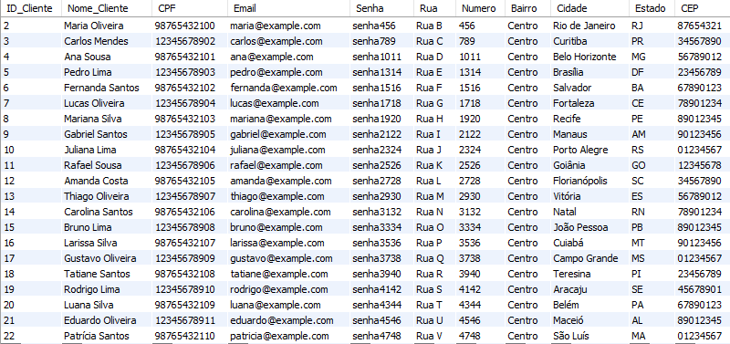

<p>Resultado da tabela Telefone_Cliente</p>
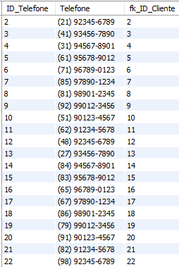

<p>Resultado da tabela Produto</p>
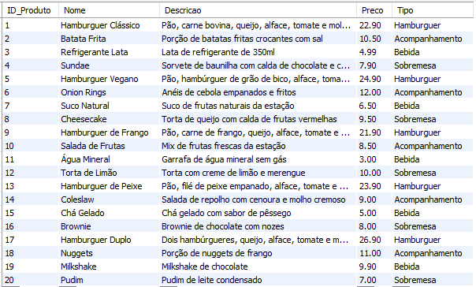

<p>Resultado da tabela Item_Pedido</p>

> [!WARNING]  
> O ID_ITEM começa a partir do 47 porque eu apaguei a tabela anterior e inserir uma nova. Para o ID começar a partir do 1, seria necessário settar novamente o ID da tabela Item_Pedido.

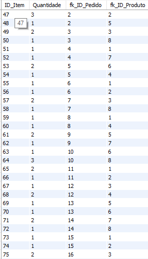

<p>Resultado da tabela Pagamento</p>
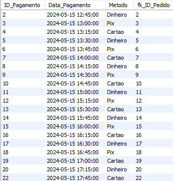

## 6- CRUD (Create, Read, Update, Delete)

### Create
> [!NOTE]  
> O Create já foi realizado na criação do banco, tabelas e inserção de dados

### Read
Consulta de Clientes com Telefone
```sql
SELECT c.Nome_Cliente, c.CPF, c.Email, tc.Telefone
FROM Cliente c
JOIN Telefone_Cliente tc ON c.ID_Cliente = tc.fk_ID_Cliente;
```
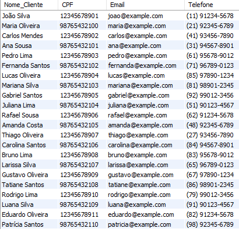

Consulta de Pedidos por Cliente
``` sql
SELECT c.Nome_Cliente, p.ID_Pedido, p.Data_Pedido, p.Status
FROM Cliente c
JOIN Pedido p ON c.ID_Cliente = p.fk_ID_Cliente
ORDER BY c.Nome_Cliente, p.Data_Pedido;
```
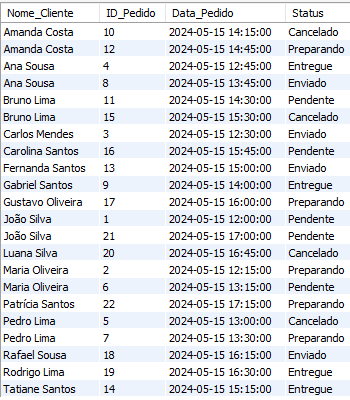

### Update
Alterou, ou seja, deu um update no nome do cliente com ID_Cliente igual a 1 para "José Silva". 
```sql
UPDATE Cliente
SET Nome_Cliente = 'José Silva'
WHERE ID_Cliente = 1;

SELECT Nome_Cliente FROM Cliente;
```


### Delete
Deletou o cliente que tinha o ID = 1.
``` sql
/* DELETE */
DELETE FROM Cliente
WHERE ID_Cliente = 1;

SELECT * FROM Cliente;

/* Antes de executar o código acima, eu tive problemas pois a linha a ser apagada ainda tinha referências secundárias em outras tabelas, então eu corrigi desta forma: */
ALTER TABLE Telefone_Cliente
DROP FOREIGN KEY telefone_cliente_ibfk_1; /* Este comando remove a chave estrangeira chamada telefone_cliente_ibfk_1 da tabela Telefone_Cliente. . Aqui, ibfk provavelmente significa "InnoDB Foreign Key" e o número 1 indica que é a primeira chave estrangeira criada automaticamente para essa tabela. */

ALTER TABLE Telefone_Cliente
ADD CONSTRAINT telefone_cliente_ibfk_1 FOREIGN KEY (fk_ID_Cliente) REFERENCES Cliente(ID_Cliente) ON DELETE CASCADE; /* Este comando adiciona uma nova chave estrangeira à tabela Telefone_Cliente. A chave estrangeira (fk_ID_Cliente) faz referência à coluna ID_Cliente na tabela Cliente. A cláusula ON DELETE CASCADE especifica que, se uma linha na tabela Cliente for deletada, todas as linhas correspondentes na tabela Telefone_Cliente também serão deletadas automaticamente. */
```
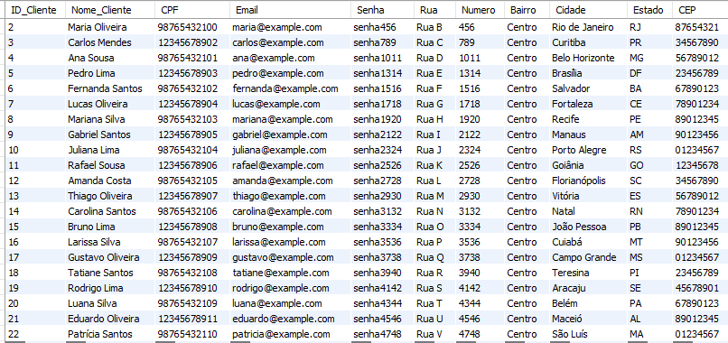
