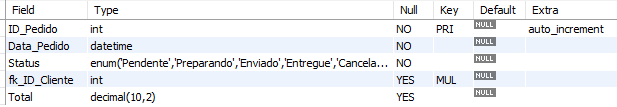
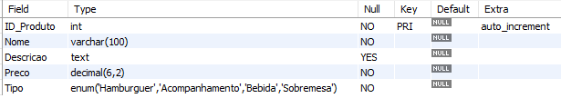

#  Bem vindo ao protótipo do B.D da Diiner's Burgers 🍔

## 1- Cenário Detalhado
A Diiner's Burgers, empresa fictícia criada para realização do P.I da FATEC-Franca, deseja desenvolver um sistema de banco de dados para gerenciar suas operações de vendas realizadas pelo Web Site, incluindo o cadastro de clientes, produtos (hambúrgueres , acompanhamentos, bebidas e sobremesas), pedidos, entregas e pagamentos. Para isso, foi elaborado este banco de dados para atender a demanda e as necessidades do cliente.

## 2- Modelagem Conceitual
A modelagem conceitual foi realizada pelo brModelo e atendeu os conceitos do MER e DER


## 3- Modelagem Lógica
A modelagem conceitual foi realizada pelo brModelo


## 4- Modelagem Física

Criando e selecionando o banco de dados
```sql
CREATE DATABASE DB_BURGER;
USE DB_BURGER;
```

Criando as tabelas
```sql
CREATE TABLE Cliente (
    ID_Cliente INT PRIMARY KEY AUTO_INCREMENT,
    Nome_Cliente VARCHAR(100) NOT NULL,
    CPF VARCHAR(11) NOT NULL UNIQUE,
    Email VARCHAR(100) NOT NULL UNIQUE,
    Senha VARCHAR(100) NOT NULL,
    Rua VARCHAR(100),
    Numero INT,
    Bairro VARCHAR(50),
    Cidade VARCHAR(50),
    Estado CHAR(2),
    CEP VARCHAR(8)
);
CREATE TABLE Telefone_Cliente (
    ID_Telefone INT PRIMARY KEY AUTO_INCREMENT,
    Telefone VARCHAR(15),
    fk_ID_Cliente INT,
    FOREIGN KEY (fk_ID_Cliente) REFERENCES Cliente(ID_Cliente)
);

CREATE TABLE Produto (
    ID_Produto INT PRIMARY KEY AUTO_INCREMENT,
    Nome VARCHAR(100) NOT NULL,
    Descricao TEXT,
    Preco DECIMAL(6, 2) NOT NULL,
    Tipo ENUM('Hamburguer', 'Acompanhamento', 'Bebida', 'Sobremesa') NOT NULL,
    CHECK (Preco > 0)
);
 
CREATE TABLE Pedido (
    ID_Pedido INT PRIMARY KEY AUTO_INCREMENT,
    Data_Pedido DATETIME NOT NULL,
    Status ENUM('Pendente', 'Preparando', 'Enviado', 'Entregue', 'Cancelado') NOT NULL,
    fk_ID_Cliente INT,
    FOREIGN KEY (fk_ID_Cliente) REFERENCES Cliente(ID_Cliente) ON DELETE CASCADE
);

ALTER TABLE Pedido
ADD COLUMN Total DECIMAL(10, 2);

CREATE TABLE Item_Pedido (
    ID_Item INT PRIMARY KEY AUTO_INCREMENT,
    Quantidade INT NOT NULL,
    fk_ID_Pedido INT,
    fk_ID_Produto INT,
    FOREIGN KEY (fk_ID_Pedido) REFERENCES Pedido(ID_Pedido) ON DELETE CASCADE,
    FOREIGN KEY (fk_ID_Produto) REFERENCES Produto(ID_Produto) ON DELETE CASCADE
);

CREATE TABLE Pagamento (
    ID_Pagamento INT PRIMARY KEY AUTO_INCREMENT,
    Data_Pagamento DATETIME NOT NULL,
    Metodo ENUM('Cartao', 'Dinheiro', 'Pix') NOT NULL,
    fk_ID_Pedido INT,
    FOREIGN KEY (fk_ID_Pedido) REFERENCES Pedido(ID_Pedido) ON DELETE CASCADE
);

/* 
CALCULANDO O VALOR TOTAL DA TABELA PEDIDO - TIVE QUE PESQUISAR NA INTERNET
Dica:
O ip é um alias (apelido) escolhido para a tabela Item_Pedido, usado para simplificar as referências à tabela no restante da consulta.
O p é um alias escolhido para a tabela Produto.
é possível fazer sem o alias, porém o código fica mais poluído. Ficaria assim:
	FROM Item_Pedido
	JOIN Produto ON Item_Pedido.ID_Produto = Produto.ID_Produto
	WHERE Item_Pedido.ID_Pedido = Pedido.ID_Pedido
*/

DELIMITER //
CREATE TRIGGER calcular_total_pedido
AFTER INSERT ON Item_Pedido
FOR EACH ROW
BEGIN
    UPDATE Pedido
    SET Total = (SELECT SUM(ip.Quantidade * p.Preco)
                 FROM Item_Pedido ip
                 JOIN Produto p ON ip.fk_ID_Produto = p.ID_Produto
                 WHERE ip.fk_ID_Pedido = NEW.fk_ID_Pedido)
    WHERE ID_Pedido = NEW.fk_ID_Pedido;
END;
//
DELIMITER ;
```
Resultado das tabelas antes da inserção das tuplas





